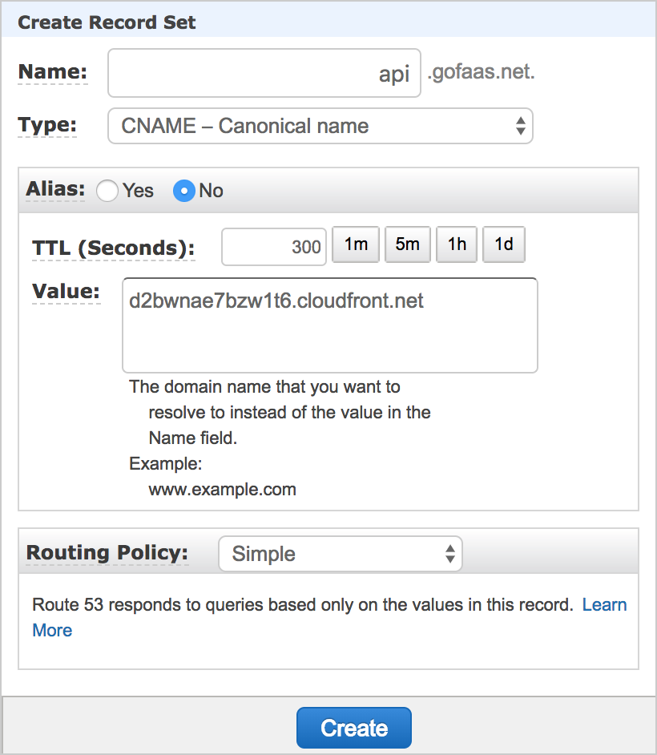

# Custom Domains
### With Lambda, API Gateway, ACM and CloudFront

When we are ready to take our gofaas app live, we likely want to move the API off of the `https://x19vpdk568.execute-api.us-east-1.amazonaws.com/Prod` API Gateway URL and onto our own domain, say `https://api.gofaas.net`.

AWS supports this by creating a CloudFront distribution that will route requests to the API Gateway URL. The CloudFront CDN naturally enables custom domain names and SSL certificates.

## AWS Config

We use two CloudFormation concepts: parameters and conditions. 

Parameters are values we specify to configure AWS resources, in this case the desired domain name. Conditions are rules that determine if AWS resources are created, in this case we only create the resources if the domain name parameter is set.

The [CloudFormation Template Anatomy reference](https://docs.aws.amazon.com/AWSCloudFormation/latest/UserGuide/template-anatomy.html) offers more guidance on how parameters and conditions work.

One new resource is an `AWS::CertificateManager::Certificate` (ACM cert) for our domain name. ACM generates and renews SSL certificates automatically for free, solving the cost and paperwork problems of SSL in the past.

The other new resources are an `AWS::ApiGateway::DomainName` and `AWS::ApiGateway::BasePathMapping` which represent the CloudFront distribution and mapping to our API Gateway endpoint respectively.

```yaml
Conditions:
  ApiDomainNameSpecified: !Not [!Equals [!Ref ApiDomainName, ""]]

Parameters:
  ApiDomainName:
    Default: ""
    Type: String

Resources:
  ApiGatewayCertificate:
    Condition: ApiDomainNameSpecified
    Properties:
      DomainName: !Ref ApiDomainName
    Type: AWS::CertificateManager::Certificate

  ApiGatewayDomainName:
    Condition: ApiDomainNameSpecified
    Properties:
      CertificateArn: !Ref ApiGatewayCertificate
      DomainName: !Ref ApiDomainName
    Type: AWS::ApiGateway::DomainName

  ApiGatewayMapping:
    Condition: ApiDomainNameSpecified
    Properties:
      DomainName: !Ref ApiGatewayDomainName
      RestApiId: !Ref ServerlessRestApi
      Stage: !Ref ServerlessRestApiProdStage
    Type: AWS::ApiGateway::BasePathMapping
```
> From [template.yml](../template.yml)

## Deploy command

Now we deploy the app, specifying a value for the `ApiDomainName` parameter. Behind the scenes AWS will automatically set up a cert and distribution.

Note that the cert requires email approval from someone that administers the root `gofaas.net` domain. During this deploy, check your email and click through on the approval buttons or else the deploy will eventually fail and roll back. See the [ACM Email Validation](https://docs.aws.amazon.com/acm/latest/userguide/gs-acm-validate-email.html) doc for more info.

Also note that creating the CloudFront distribution could take 15 minutes or more. Be patient while AWS sets up infrastructure all around the globe for our API...

```shell
$ make deploy PARAMS="ApiDomainName=api.gofaas.net"
...
ApiUrl	https://api.gofaas.net
ApiDistributionDomainName	d2bwnae7bzw1t6.cloudfront.net
```

## DNS

The final step is to set up a DNS CNAME from our `ApiDomainName` parameter (e.g. `api.gofaas.net`) to the new `ApiDistributionDomainName` output (e.g. `d2bwnae7bzw1t6.cloudfront.net`).

If we are using Route53, this is easy to do through the UI:

<p align="center"></p>

In this case we could consider automating DNS setup by adding an conditional `AWS::Route53::RecordSet` resource to our template...

After a few minutes we have our custom HTTPS API endpoint:

```shell
$ curl https://api.gofaas.net
<html><body><h1>gofaas dashboard</h1></body></html>
```

## Summary

When building an app with CloudFormation, API Gateway and CloudFront we can:

- Serve our API from a custom domain
- Automate cert creation and renewal
- Distribute our API through a global CDN

We no longer have to worry about:

- Generating or paying for certificates
- Configuring HTTP servers

Our API is easier and cheaper to set up.
