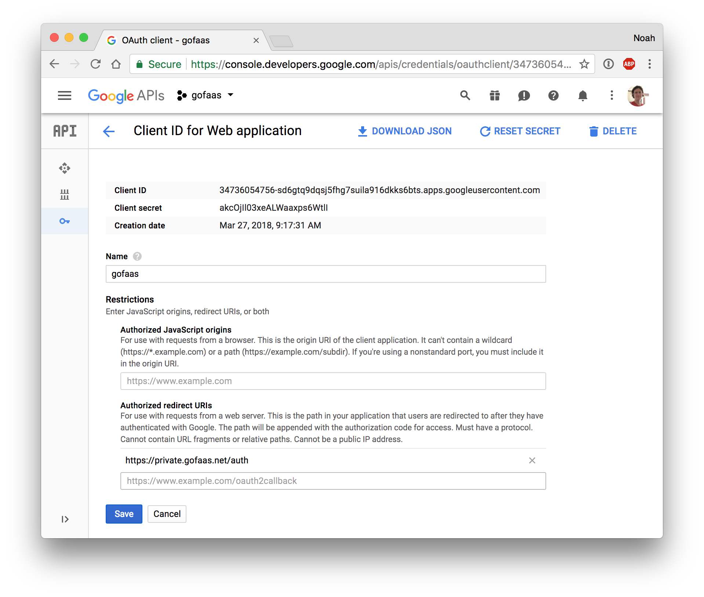
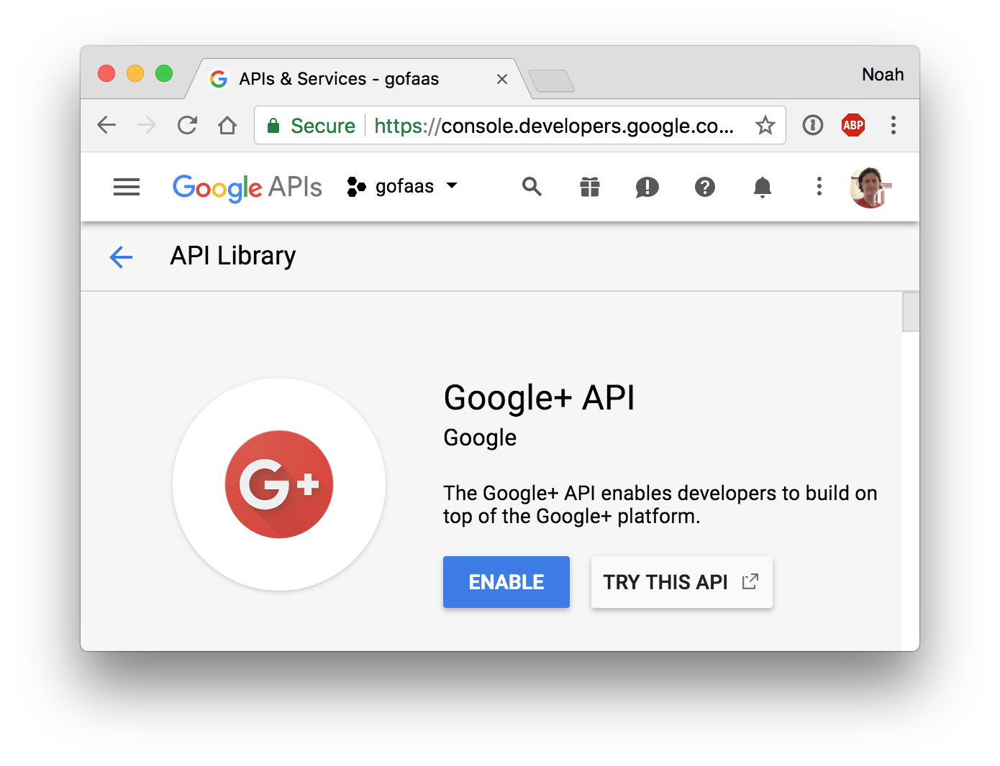

# Static Website Security
### With Lambda@Edge and Google OAuth 2.0

Deploying static web content is a solved problem thanks to S3 and CloudFront. However this design has one big side effect: the static content is publicly available to the entire internet. What if our application is more sensitive like an admin app or an internal business tool and we need to restrict access to only people that belong to our company?

Previously we would add a "proxy server" -- an HTTP server like nginx, plus a load balancer and a private network -- to get the access control we need. While this adds security, we lose a lot of simplicity and reliability.

What we need instead is a way to configure access with the "proxy" we already have: CloudFront. AWS offers a function-as-a-service approach here with Lambda@Edge.

Lambda@Edge is a variant of Lambda that runs "inside" CloudFront. The Lambda function is given an event that describes an HTTP request, and it returns an event that that controls the response to send to the client. This unlocks a lot of options. We can modify the body of the request to the origin, add headers and/or rewrite the URL. We can also modify the response to the users and change the body or add headers. 

This is perfect for authentication. Instead of always responding with our content from S3, we can first check the request for an authorization cookie and redirect to an OAuth provider if missing. We can then handle the OAuth callback and set a cookie for the user. Subsequent requests will pass the auth check and we can request and return the content from S3. All with a simple Lambda function.

Let's set this up for our app...

## JavaScript Code -- Lambda@Edge Handler

Lambda@Edge only supports the `Node.js 6.10` runtime, presumably to increase the security and reliability when running "inside" CloudFront. So let's start with the general shape of a JavaScript handler function:

```js
var Params = {
    AuthDomainName: "gofaas.net",
    AuthHashKey: "43Z647ntcQ8L5LfNi2HlW3XXJYz5x9Y/EYv6C7gdajo=",
    OAuthClientId: "347...apps.googleusercontent.com",
    OAuthClientSecret: "akc...",
    Scope: [
        "https://www.googleapis.com/auth/plus.login",
        "https://www.googleapis.com/auth/userinfo.email",
    ],
};

exports.handler = (event, context, callback) => {
    var request = event.Records[0].cf.request;

    // Handle OAuth callback, e.g. /auth?code=...&session_state=...
    // Exchange for OAuth token and profile
    // Set access_token cookie and redirect to /
    if (request.uri === "/auth")
        return auth(request, callback);

    try {
        // Decode token
        var key = new Buffer(Params.AuthHashKey, "base64");
        jwt.decode(requestCookie(request, "access_token"), key);

        // Make request to origin
        callback(null, request);
    }
    catch (err) {
        // Token is invalid
        // Start OAuth flow with redirect to https://accounts.google.com/signin/oauth?client_id=...
        auth(request, callback);
    }
};
```
> From [web/handlers/auth/index.js](../web/handlers/auth/index.js)

We expect Lambda@edge to invoke the `exports.handler` function with an `event` that describes the HTTP request and a `callback` that we call with an event that describes our HTTP response. 

The request event includes HTTP headers, which enables us to check for a cookie. If the cookie invalid we will call `callback` with redirect response event:

```js
{
    status: "302",
    statusDescription: "Found",
    headers: {
        location: [{
            key: "Location",
            value: "https://accounts.google.com/signin/oauth?client_id=...",
        }],
    },
}
```

If the cookie is valid we will call `callback` with the original request to the origin:

```js
callback(null, event.Records[0].cf.request;);
```

The request event also contains the request URL and query string, which enables us to process the OAuth callback. Lambda@Edge allows us to make external HTTP requests in the handler, so we can ask Google exchange the OAuth callback code for a the user's OAuth token and profile (name and email).

For full details about the event objects, see the [Lambda@Edge Event Structure](https://docs.aws.amazon.com/AmazonCloudFront/latest/DeveloperGuide/lambda-event-structure.html) guide.

As we can see, Lambda@Edge offers everything we need to handle OAuth.

## JavaScript Code -- Google OAuth 2.0

Web authentication is nothing new to the Node.js ecosystem. Here we turn to the [Passport](http://www.passportjs.org/) library which offers "strategies" for many auth providers like Auth0, Google, GitHub and more. For this example we will use the [passport-google-oauth2](https://github.com/jaredhanson/passport-google-oauth2) package which implements Google OAuth 2.0 auth.

First we need to set up our OAuth 2.0 app on Google. Browse to the [Google API Credentials](https://console.developers.google.com/apis/credentials) page to create a project and "OAuth client ID" credentials for a "web application". Then browse to the [Google+ API](https://console.developers.google.com/apis/library/plus.googleapis.com/) library page to enable Google+ as an identity and email scope provider.

<p align="center">
  
  
</p>

For more information see the [Using OAuth 2.0 for Web Server Applications](https://developers.google.com/identity/protocols/OAuth2WebServer) developer guide.

Next it takes a bit of hacking to use Passport outside of the [Express](https://expressjs.com/) web framework, but thanks to it's flexibility it is possible. We instantiate the `GoogleStrategy` class with our OAuth Client ID and secret, and hook up the strategy callbacks for auth redirect, success or failure to our Lambda response callback.

```js
var GoogleStrategy = require("passport-google-oauth20").Strategy;
var querystring = require("querystring");

var auth = (request, callback) => {
    var host = request.headers.host[0].value;
    var query = querystring.parse(request.querystring);

    var opts = {
        clientID: Params.OAuthClientId,
        clientSecret: Params.OAuthClientSecret,
        callbackURL: `https://${host}/auth`,
    };

    var s = new GoogleStrategy(opts, (token, tokenSecret, profile, done) => {
        profile.emails.forEach((email) => {
            if (email.value.endsWith(Params.AuthDomainName)) {
                return done(null, profile); // call success with profile
            }
        });

        // call fail with warning
        done(null, false, {
            name: "UserError",
            message: "Email is not a member of the domain",
            status: "401",
        });
    });

    s.error = (err) => {
        callback(null, responseError(err)); // respond with 401
    };

    s.fail = (warning) => {
        callback(null, responseError(warning)); // respond with 401
    };

    s.redirect = (url) => {
        callback(null, responseRedirect(url)); // respond with 302 to begin OAuth flow
    };

    s.success = (profile) => {
        var exp = new Date(new Date().getTime() + 86400000); // 1 day from now
        var key = new Buffer(Params.AuthHashKey, "base64");

        var token = jwt.encode({
            exp: Math.floor(exp / 1000),
            sub: profile.emails[0].value,
        }, key);

        callback(null, responseCookie(token, exp, `https://${host}/`)); // respond with 302 to set cookie and redirect to /
    };

    s.authenticate({ query }, { scope: Params.Scope });
};
```

## AWS Config

Now we need to configure AWS for our static site and Lambda@Edge handler. We can start with the S3 and CloudFront config from the [static sites](static-sites.md) example, and make a few changes.

First we need to guarantee that our S3 bucket is only accessible through CloudFront. So we make sure to remove any S3 config for public access. Then we add an [S3 Bucket Policy](https://docs.aws.amazon.com/AmazonS3/latest/dev/example-bucket-policies.html) that only grants read access to a [CloudFront Origin Access Identity](https://docs.aws.amazon.com/AmazonCloudFront/latest/DeveloperGuide/private-content-restricting-access-to-s3.html) and a CloudFront `S3OriginConfig`. This guarantees that our content is only available via the CloudFront distribution and not over the `s3-website-us-east-1.amazonaws.com` or `s3.amazonaws.com` style URLs.

Next we associate a Lambda function with our distribution. Here we configure a `viewer-request` event to invoke a function when CloudFront receives a request from the viewer. This is the earliest event possible, and gives us the ability to redirect and/or block requests from the origin based on our auth flow.

```yaml
---
AWSTemplateFormatVersion: '2010-09-09'

Resources:
  WebBucket:
    Properties:
      BucketName: !Ref WebDomainName
      WebsiteConfiguration:
        ErrorDocument: 404.html
        IndexDocument: index.html
    Type: AWS::S3::Bucket

  WebBucketPolicy:
    Properties:
      Bucket: !Ref WebBucket
      PolicyDocument:
        Statement:
          - Action: s3:GetObject
            Effect: Allow
            Principal:
              CanonicalUser: !GetAtt WebOriginAccessIdentity.S3CanonicalUserId
            Resource: !Sub arn:aws:s3:::${WebBucket}/*
            Sid: GetObjectsCloudFront
    Type: AWS::S3::BucketPolicy

  WebCertificate:
    Properties:
      DomainName: !Ref WebDomainName
    Type: AWS::CertificateManager::Certificate

  WebDistribution:
    Properties:
      DistributionConfig:
        Aliases:
          - !Ref WebDomainName
        Comment: !Sub Distribution for ${WebBucket}
        DefaultCacheBehavior:
          AllowedMethods:
            - GET
            - HEAD
          Compress: true
          ForwardedValues:
            Cookies:
              Forward: none
            QueryString: true
          LambdaFunctionAssociations:
            EventType: viewer-request
              LambdaFunctionARN: !Ref WebAuthFunction.Version
          TargetOriginId: !Ref WebBucket
          ViewerProtocolPolicy: redirect-to-https
        DefaultRootObject: index.html
        Enabled: true
        HttpVersion: http2
        Origins:
          - DomainName: !Sub ${WebBucket}.s3.amazonaws.com
            Id: !Ref WebBucket
            S3OriginConfig:
              OriginAccessIdentity: !Sub origin-access-identity/cloudfront/${WebOriginAccessIdentity}
        PriceClass: PriceClass_All
        ViewerCertificate:
          AcmCertificateArn: !Ref WebCertificate
          SslSupportMethod: sni-only
    Type: AWS::CloudFront::Distribution

  WebOriginAccessIdentity:
    Condition: WebDomainNameSpecified
    Properties:
      CloudFrontOriginAccessIdentityConfig:
        Comment: !Ref WebBucket
    Type: AWS::CloudFront::CloudFrontOriginAccessIdentity
```
> From [template.yml](template.yml)

This is a remarkable setup. Our static content in S3 can not be accessed except through CloudFront and our Lambda@Edge function. We get the same behavior of a proxy server, with single Lambda function.

## JavaScript Code - JSON Web Tokens

The final concern is what we give a user to prove that they are authenticated. For this we turn to the industry standard for representing claims securely between two parties: [JSON Web Tokens](https://jwt.io/) (JWT).

With JWT we use a secret "hash key" to sign a JSON "payload" in our Lambda function and give an encoded version of the JSON -- a "token" -- to the user in a cookie. The user will present the token on every request and the auth function will validate it. No 3rd party can create a valid token without the secret hash key, so we are confident a user with a valid token was authorized by us.

We can use the [jwt-simple](https://github.com/hokaccha/node-jwt-simple) Node.js library to encode and decode JWT tokens:

```js
var jwt = require("jwt-simple");

var encode = (profile) => {
    var exp = new Date(new Date().getTime() + 86400000); // 1 day from now
    var key = new Buffer(Params.AuthHashKey, "base64");

    var token = jwt.encode({
        exp: Math.floor(exp / 1000),
        sub: profile.emails[0].value,
    }, key);

    callback(null, responseCookie(token, exp, `https://${host}/`));
};

var decode = (request) => {
    try {
        var key = new Buffer(Params.AuthHashKey, "base64");
        jwt.decode(requestCookie(request, "access_token"), key);
        callback(null, request);
    }
    catch (err) {
        // missing or invalid token
    }
};
```

In addition to authorizing access to the static content, a user can send the JWT in an `Authorization` HTTP header to an API. If we share the hash key between the web Lambda@Edge function and API Lambda functions, we now have a strategy for securing API access from a web app. See the [Function security with JSON Web Tokens](security-cors-jwt.md) guide for more information.

For more information about JWT, see the [Introduction to JSON Web Tokens](https://jwt.io/introduction/) guide.

## Summary

S3, CloudFront, Lambda@Edge and JWT allows us to:

- Block static content from unauthorized users
- Perform the Google OAuth flow "inside" CloudFront
- Secure API calls from a static web app to an API

We no longer have to worry about:

- Running HTTP proxy servers
- Adding OAuth middleware to our web app code

Our app is easier to build and more secure with a Lambda@Edge function.