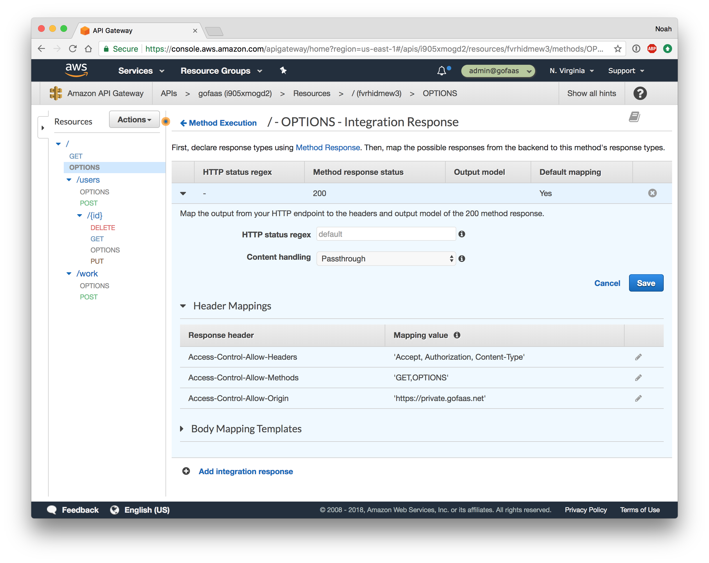

# API Security
### With Lambda, API Gateway, CORS and JSON Web Tokens

In the [static website security](lambda-at-edge-oauth.md) guide, we looked at securing our static web app with OAuth and a JSON Web Token (JWT) cookie. The next step is to secure our API so only our web app can access it after user authentication.

The first means of API protection is Cross-Origin Resources Sharing (CORS). By default web browsers have a layer of security where content from one domain, e.g. the `private.gofaas.net` web app, can not make requests to another domain, e.g. the `api.gofaas.net` API. This is extremely important to prevent malicious JavaScript on a web page from interacting with the Google, Facebook, a bank account, etc. we might be logged into. CORS gives us a way to white-list access between domains we control and trust.

The second means of protection is the JWT token. With JWT we use a secret "hash key" to give a signed token the user in a cookie. The user will present the token on every API request and the auth function will validate it. No 3rd party can create a valid token without the secret hash key, so we are confident a user with a valid token was authorized by us.

Let's set this up for our API...

## AWS Config -- CORS

As of [SAM 1.4.0](https://github.com/awslabs/serverless-application-model/releases/tag/1.4.0), CORS is very easy to configure. The `AWS::Serverless::Api` resource has a [CORS configuration](https://github.com/awslabs/serverless-application-model/blob/master/versions/2016-10-31.md#cors-configuration) property where we can explicitly white list the origins that can access our API, along with the methods and headers that they can use.

So it's a simple matter of adding our static web site domain to the `AllowOrigin` list.

```yaml
---
AWSTemplateFormatVersion: '2010-09-09'

Globals:
  Api:
    Cors:
      AllowHeaders: "'Accept, Authorization, Content-Type'"
      AllowOrigin:
        !If
        - WebDomainNameSpecified
        - !Sub "'https://${WebDomainName}'"
        - Fn::Sub: ["'http://${WebBucket}.${Endpoint}'", {Endpoint: !FindInMap [RegionMap, !Ref "AWS::Region", S3WebsiteEndpoint]}]

Transform: AWS::Serverless-2016-10-31
```

This adds new HTTP `OPTIONS` resources to our API Gateway.

<p align="center"></p>

Now when a web browser makes a CORS pre-flight OPTIONS request, API gateway returns the whitelist of origins, and the browser will prevent making the actual API request from any domains not in the whitelist.

For more information about CORS, check out the [Mozilla CORS guide](https://developer.mozilla.org/en-US/docs/Web/HTTP/CORS).

## Go Code -- JWT

Now that the web app is white-listed to access our API, we want to make sure that requests are from authenticated users. For this our API can look for an HTTP request header with the JWT, and validate the token before allowing access.

```go
func JWTClaims(e events.APIGatewayProxyRequest, claims jwt.Claims) (events.APIGatewayProxyResponse, jwt.Claims, error) {
	// API responses also need a CORS header for the browser to access the response body
	r := events.APIGatewayProxyResponse{
		Headers: map[string]string{
			"Access-Control-Allow-Origin": header(e, "Origin"),
		},
		StatusCode: 401,
	}

	// Decode shared secret key
	key, err := base64.StdEncoding.DecodeString(os.Getenv("AUTH_HASH_KEY"))
	if err != nil {
		r.Body = fmt.Sprintf("{\"error\": %q}", err)
		r.StatusCode = 500
		return r, claims, errors.WithStack(err)
	}

	// Parse JWT in header and return 401 if invalid
	tokenString := strings.TrimPrefix(header(e, "Authorization"), "Bearer ")
	token, err := jwt.ParseWithClaims(tokenString, claims, func(token *jwt.Token) (interface{}, error) {
		return key, nil
	})
	if !token.Valid {
		err = errors.New("Invalid token")
	}
	if err != nil {
		r.Body = fmt.Sprintf("{\"error\": %q}", err)
		r.StatusCode = 401
		return r, claims, errors.WithStack(err)
	}

	r.StatusCode = 200
	return r, claims, nil
}
```
> From [jwt.go](jwt.go)

Now we can add this check to the top of our protected API functions:

```go
// WorkCreate invokes the worker func
func WorkCreate(ctx context.Context, e events.APIGatewayProxyRequest) (events.APIGatewayProxyResponse, error) {
	r, _, err := JWTClaims(e, &jwt.StandardClaims{})
	if err != nil {
		return r, nil
	}
	
	...
}
```
> From [worker.go](../worker.go)

## JS Code -- JWT

Finally our API is ready for web app client to talk to it. We can use the `fetch` method with the `cors` mode and an `Authorization` header with the JWT cookie value.

```js
fetch(`https://api.gofaas.net/work`, {
    method: "POST",
    mode: "cors",
    headers: {
        "Accept": "application/json",
        "Authorization": `Bearer ${getCookie("access_token")}`,
        "Content-Type": "application/json"
    }
})
    .then(function(response) {
        return response.json();
    })
    .then(function (json) {
        // use response
    })
    .catch(function (err) {
        console.log("fetch error", err);
    });
```
> From [web/static/js/app.js](../web/static/js/app.js)

## Summary

API Gateway, CORS and JWT allow us to:

- Prevent API access from un-trusted web pages
- Restrict API calls to authorized users
- Give a token to a user in Lambda@Edge and verify the token in Lambda

We no longer have to:

- Add CORS middleware to our API code
- Add API key or password management to our API code

Our app is easier to build and more secure with API Gateway and JWT.