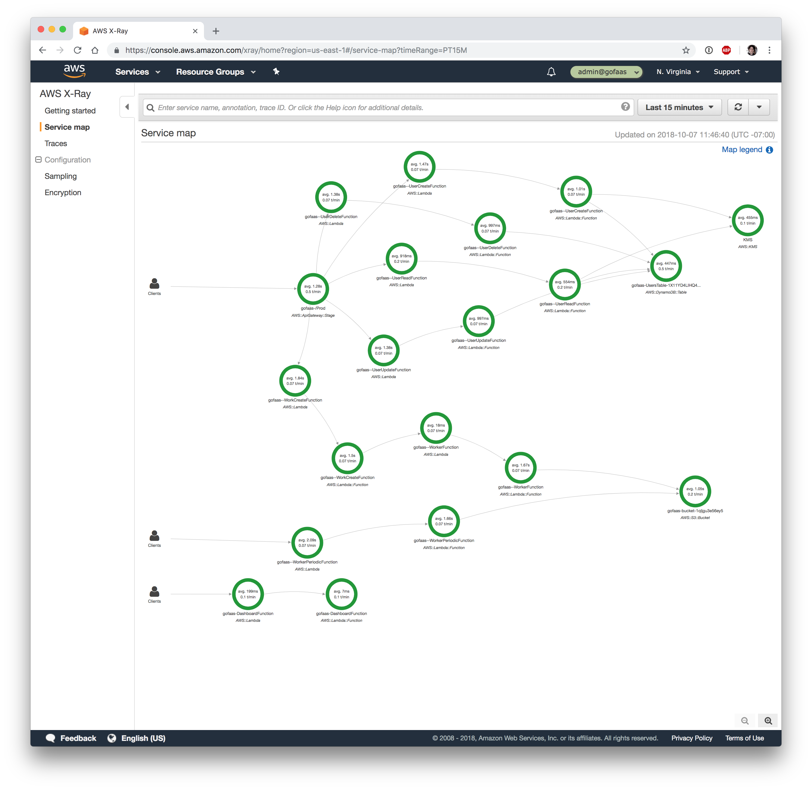
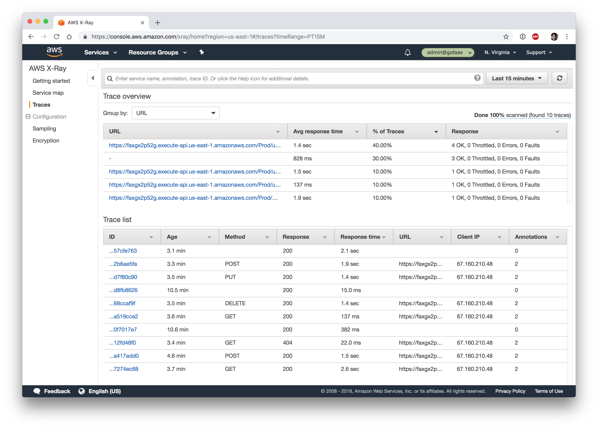
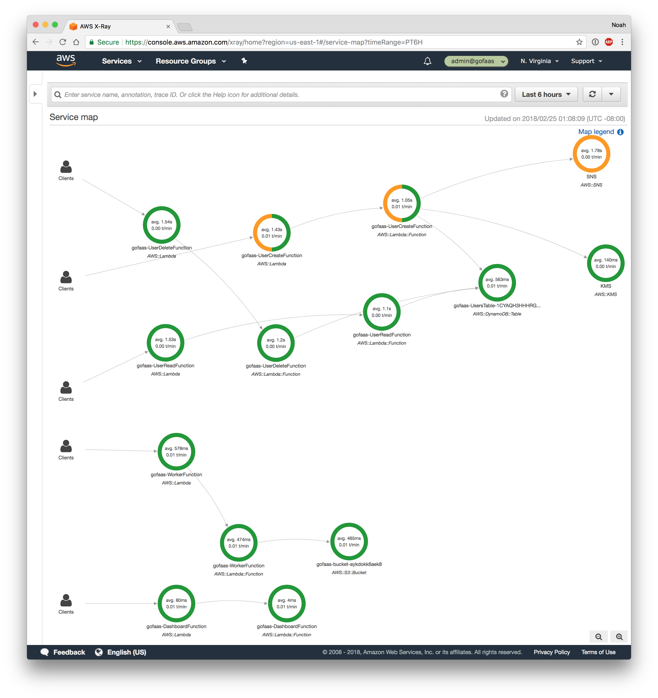
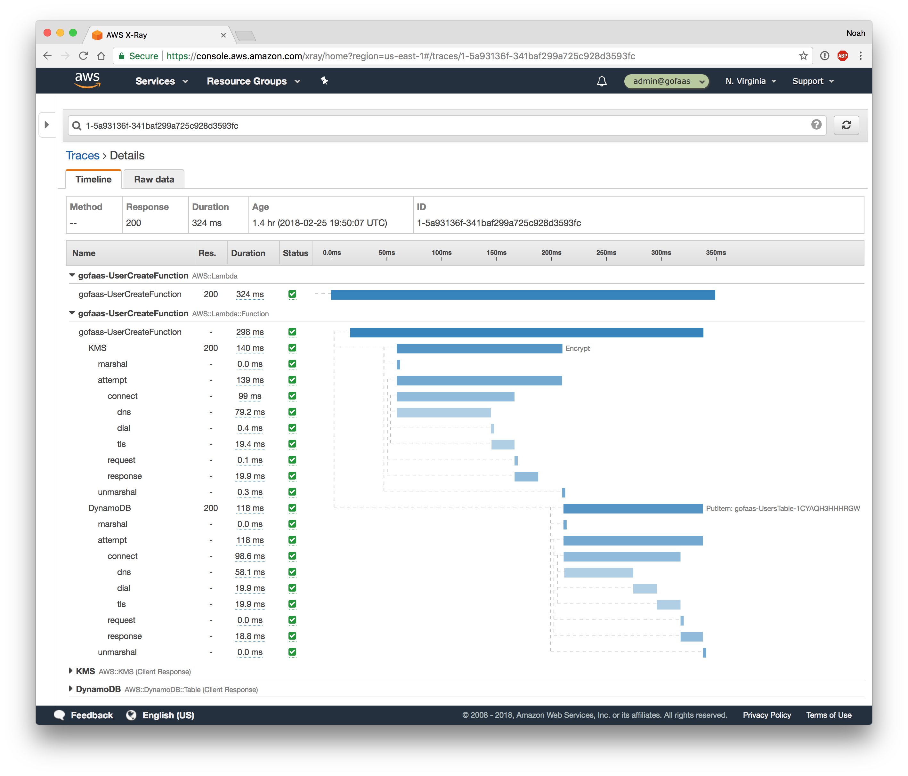
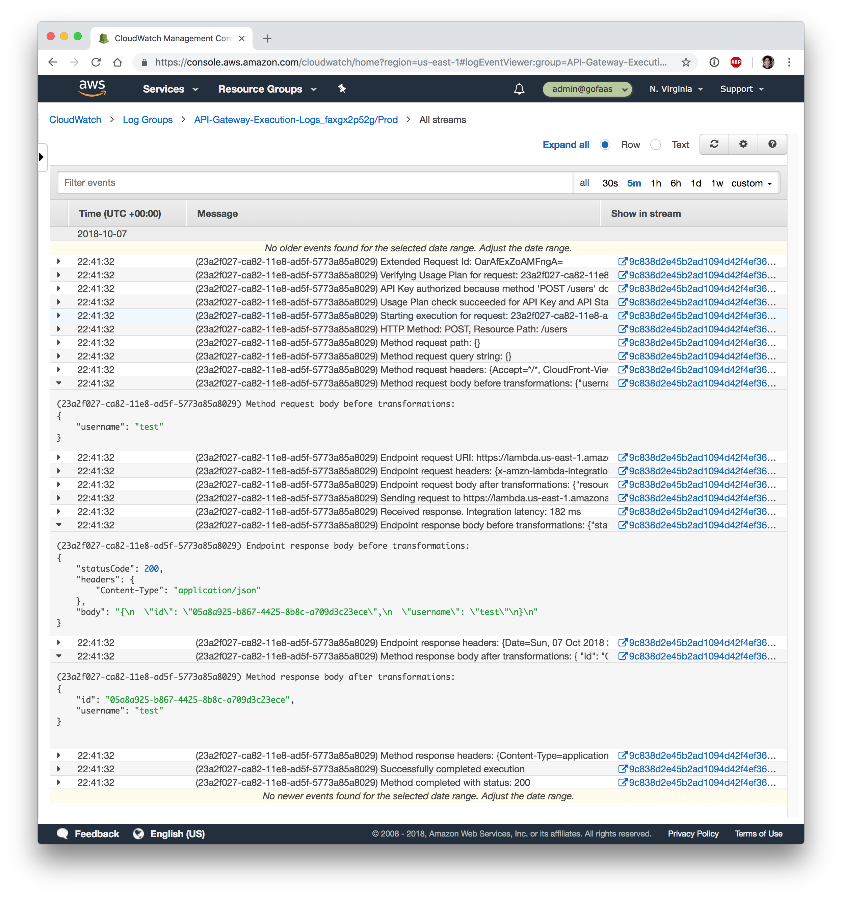

# Function Traces and Logs
### With API Gateway, Go, Lambda, CloudWatch Logs and X-Ray

As we keep adding more functions with responsibilities for various services, it can become a challenge to spot and diagnose errors.

Imagine if we see error from a worker API. How do we know if error was due to:

- AWS API Gateway internal error
- AWS Lambda capacity problem
- Our worker function
- AWS S3 permission error

We will naturally add more logging to our Go code over time to help understand execution. But Go on Lambda offers a new and compelling strategy for observability: tracing.

Tracing is a technique that big companies like Amazon, Google and Twitter rely on to understand their large-scale distributed systems.

With tracing, every request that comes in is given a unique request ID. Then care is taken to pass this request ID along to every subsystem that works on the request so they can report detailed, structured information about how they handled the request. This information is reported as "segments" of work -- data with a start time, end time and other metadata like a function name, return value or error message.

One system might emit segments for many short function calls, then a single long RPC call. And the system that performs the RPC call itself might emit many segments for its function calls.

A centralized tracing service collects data from all the disparate systems and server and assembles them to provide a full picture of the life cycle of the request. We can now see total response time, individual steps and their duration, and in the case of a failure, pinpoint exactly where it happened.

## AWS Config -- X-Ray and Lambda

Tracing is a first-class concept on AWS Lambda. We can turn on "active tracing" in the SAM `Globals` section or as a property of every Lambda function:

```yaml
Globals:
  Function:
    Tracing: Active

Resources:
  WorkerFunction:
    Properties:
      Tracing: Active
    Type: AWS::Serverless::Function
```
> From [template.yml](../template.yml)

When this is enabled, AWS will automatically run a X-Ray daemon for our Lambda function.

## AWS Config -- X-Ray and API Gateway

Tracing is also a first-class concept on API Gateway. When enabled, a trace is generated when an API request starts, and includes its request type, response time, and status code. Unfortunately at the time of writing, SAM and CloudFormation don't support enabling tracing, but we can use a CloudFormation Custom Resource to manage the setting:

```yaml
Resources:
  ApiGatewayStage:
    Properties:
      RestApiId: !Ref ServerlessRestApi
      ServiceToken: !GetAtt CustomResourceFunction.Arn
      Stage:  !Ref ServerlessRestApiProdStage
      TracingEnabled: true
    Type: Custom::ApiGatewayStage

  CustomResourceFunction:
    Properties:
      CodeUri: ./handlers/custom-resource
      FunctionName: !Sub ${AWS::StackName}-CustomResourceFunction
      Handler: main
      Policies:
        - arn:aws:iam::aws:policy/AmazonAPIGatewayAdministrator
      Runtime: go1.x
    Type: AWS::Serverless::Function
```
> From [template.yml](../template.yml)

See [Setting up AWS X-Ray with API Gateway](https://docs.aws.amazon.com/apigateway/latest/developerguide/apigateway-enabling-xray.html) for more details.

## Go Code -- Context pattern

Tracing is effectively a first-class concept in Golang too.

Go was created by Google with a goal of making distributed systems programming easy, so it should come as no surprise that it well-suited for tracing. The standard library has what we need: the [context package](https://golang.org/pkg/context/) and the Context type.

We may have noticed that every Lambda function takes a first argument of `ctx context.Context`. We also see the `ctx` argument in many other Go packages like the AWS SDK. This variable provides a way to share information, like a request ID or a parent segment structure, across all our code and 3rd party libraries we use. Go opts for a variable for safety -- we can't safely share data between all the systems, we have to pass data down to them.

```go
package gofaas

import (
	"context"
	"os"

	"github.com/aws/aws-sdk-go/aws"
	"github.com/aws/aws-sdk-go/service/dynamodb"
	"github.com/aws/aws-sdk-go/service/kms"
	"github.com/pkg/errors"
)

func userPut(ctx context.Context, u *User) error {
	if u.TokenPlain != "" {
		out, err := KMS().EncryptWithContext(ctx, &kms.EncryptInput{
			Plaintext: []byte(u.TokenPlain),
			KeyId:     aws.String(os.Getenv("KEY_ID")),
		})
		if err != nil {
			return errors.WithStack(err)
		}

		u.Token = out.CiphertextBlob
		u.TokenPlain = ""
	}

	_, err := DynamoDB().PutItemWithContext(ctx, &dynamodb.PutItemInput{
		Item: map[string]*dynamodb.AttributeValue{
			"id": &dynamodb.AttributeValue{
				S: aws.String(u.ID),
			},
			"token": &dynamodb.AttributeValue{
				B: u.Token,
			},
			"username": &dynamodb.AttributeValue{
				S: aws.String(u.Username),
			},
		},
		TableName: aws.String(os.Getenv("TABLE_NAME")),
	})
	return errors.WithStack(err)
}
```
> From [user.go](../user.go)

When working with the AWS SDK we make sure to use the `WithContext` methods. See the [Context Pattern added to the AWS SDK for Go](https://aws.amazon.com/blogs/developer/context-pattern-added-to-the-aws-sdk-for-go/) to learn about more ways the context pattern helps us build our app.

## Go Code -- Xray SDK

Next we reach for the [aws/aws-xray-go-sdk package](https://github.com/aws/aws-xray-sdk-go). This gives us a way to generate segment data and send it to a local X-Ray daemon which will eventually forward traces to the X-Ray API.

To start, the SDK lets us wrap the AWS SDK so that all AWS API calls are traced:

```go
package gofaas

import (
	"github.com/aws/aws-sdk-go/aws/session"
	"github.com/aws/aws-sdk-go/service/dynamodb"
	"github.com/aws/aws-sdk-go/service/kms"
	"github.com/aws/aws-xray-sdk-go/xray"
)

func init() {
	xray.Configure(xray.Config{
		LogLevel: "info",
	})
}

// DynamoDB is an xray instrumented DynamoDB client
func DynamoDB() *dynamodb.DynamoDB {
	c := dynamodb.New(session.Must(session.NewSession()))
	xray.AWS(c.Client)
	return c
}

// KMS is an xray instrumented KMS client
func KMS() *kms.KMS {
	c := kms.New(session.Must(session.NewSession()))
	xray.AWS(c.Client)
	return c
}
```
> From [aws.go](../aws.go)

We can also use the X-Ray SDK to trace external HTTP calls, SQL calls, or create any custom segments and subsegments. Refer to the [X-Ray SDK for Go](https://docs.aws.amazon.com/xray/latest/devguide/xray-sdk-go.html) developer guide for more details.

## Results

After we deploy the application and make some calls to the API or workers, we can browse to the X-Ray web console to view our traces:

<p align="center">
  
  
</p>

The service map offers a overview of our app. We can see all of the calls into the API gateway, then our functions, then all the AWS APIs they consume. In the trace overview we can HTTP methods, response time and status.

<p align="center">
  
  
</p>

Tracing can really help dig into problems. Note in this service map that we see errors with SNS calls. It turns out IAM permissions are incorrect... Tracing is already helping us pinpoint problems and we haven't added a single log!

Tracing also offers a deep dive into a function call. We can see our function took 324ms, and spent 140ms on the KMS call and 200ms on the DynamoDB call. This waterfall view can help us optimize our functions, which can ultimately save us money.

These are powerful views into our functions with little change to the code and config.

## AWS Config -- API Gateway and CloudWatch

API Gateway can automatically log requests, errors, request parameters, and response payloads. We can turn on logging and "data tracing" in the SAM `Globals` section for our API. Note that we also have to grant API Gateway permission to manage create CloudWatch log groups and events:

```yaml
Globals:
  Api:
    MethodSettings:
      - DataTraceEnabled: true
        HttpMethod: "*"
        LoggingLevel: INFO
        MetricsEnabled: true
        ResourcePath: /*

Resources:
  ApiGatewayAccount:
    Properties:
      CloudWatchRoleArn: !GetAtt ApiGatewayRole.Arn
    Type: AWS::ApiGateway::Account

  ApiGatewayRole:
    Properties:
      AssumeRolePolicyDocument:
        Statement:
          - Action:
              - sts:AssumeRole
            Effect: Allow
            Principal:
              Service:
                - apigateway.amazonaws.com
            Sid: AllowServiceToAssumeRole
        Version: 2012-10-17
      ManagedPolicyArns:
        - arn:aws:iam::aws:policy/service-role/AmazonAPIGatewayPushToCloudWatchLogs
      Path: /
    Type: AWS::IAM::Role
```

## Results

<p align="center">
  
</p>

## Go Code -- Logging

Of course we can't ignore trusty logging to help us develop and debug Go functions. It's very common to aid development and debugging with `log.Printf()` statements:

```go
func MyHandler(ctx context.Context, e Event) error {
	log.Printf("MyHandler e: %+v\n", e)

	out, err := foo()
	log.Printf("MyHandler foo err=%q out: %+v\n", err, out)

	return err
}
```

It should be no surprise that Lambda supports this out of the box too. Logs printed to stdout and stderr are automatically captured and sent to CloudWatch Logs for future review.

## sam log command

We can use the `sam logs` command to review logs:

```shell
$ sam logs -n WorkerFunction --stack-name gofaas -t
2018/10/07/[$LATEST]68e50ab313c34257844b10666a0c8d62 2018-10-07T18:42:33.005000 START RequestId: c0385b8a-ca60-11e8-879c-8f9b7d940021 Version: $LATEST
2018/10/07/[$LATEST]68e50ab313c34257844b10666a0c8d62 2018-10-07T18:42:33.018000 2018/10/07 18:42:33 Worker Event: {SourceIP: TimeEnd:0001-01-01 00:00:00 +0000 UTC TimeStart:0001-01-01 00:00:00 +0000 UTC}
2018/10/07/[$LATEST]68e50ab313c34257844b10666a0c8d62 2018-10-07T18:42:34.698000 END RequestId: c0385b8a-ca60-11e8-879c-8f9b7d940021
2018/10/07/[$LATEST]68e50ab313c34257844b10666a0c8d62 2018-10-07T18:42:34.698000 REPORT RequestId: c0385b8a-ca60-11e8-879c-8f9b7d940021	Duration: 1672.96 ms	Billed Duration: 1700 ms 	Memory Size: 128 MB	Max Memory Used: 41 MB
...
```

The `sam logs` tool, and CloudWatch Logs dashboard and API offer additional ways to access logs by time, and to filter logs by a pattern. See `sam logs --help` and the [CloudWatch Logs User Guide](https://docs.aws.amazon.com/AmazonCloudWatch/latest/logs/WhatIsCloudWatchLogs.html) for more details.

## Summary

When building an app with Go, API Gateway, Lambda, CloudWatch Logs and X-Ray we can:

- See internal AWS service traces
- Add traces of function AWS API calls
- Add traces of function HTTP calls
- Visualize function flow and errors
- Collect, tail and search request and function logs

We don't have to:

- Change our Go code
- Monkey patch the language internals
- Manage trace or log collectors
- Run trace or log servers

Go, tracing and logging make our app easier to observe.
